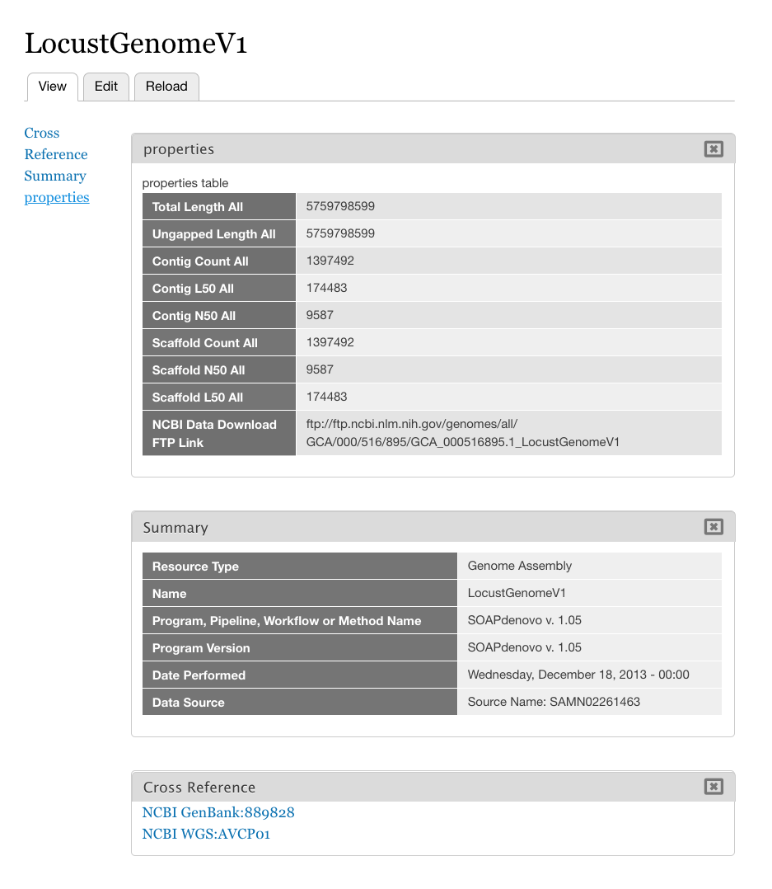
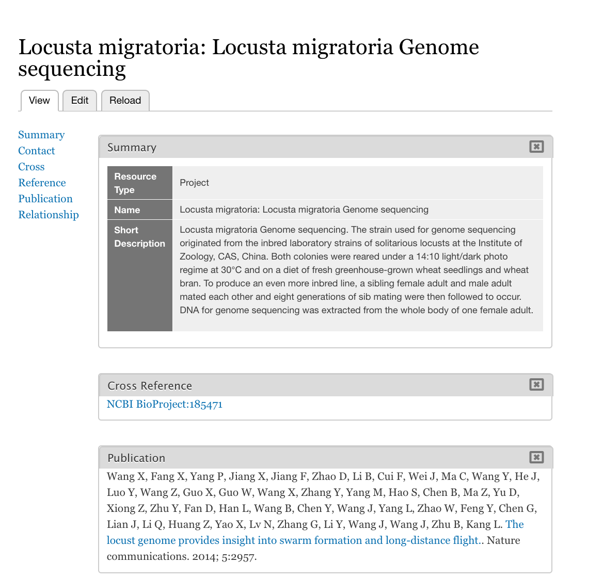
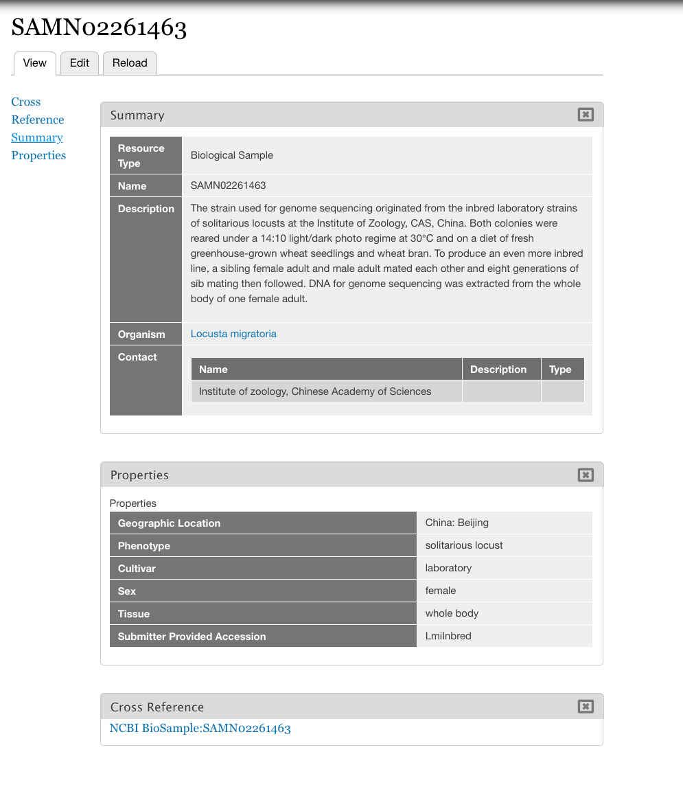
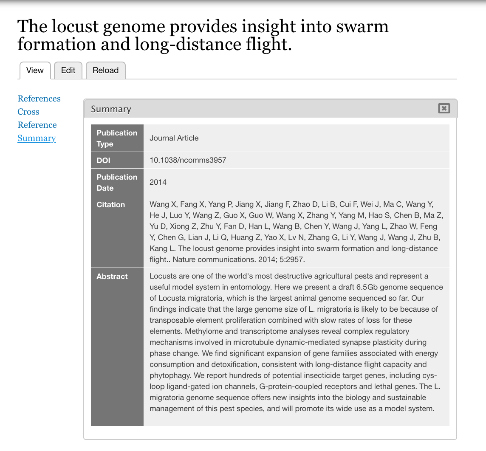
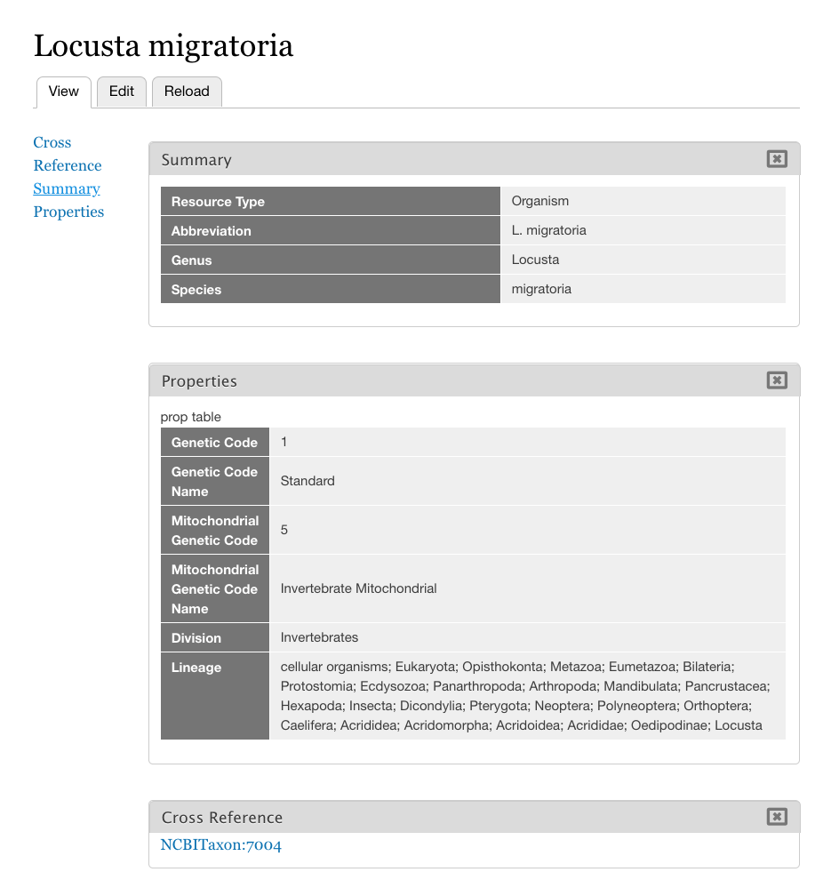

Example Created Content
======================================

This page demonstrates examples of content imported by this module.  These are the linked records inserted starting from the BioProject `PRJNA185471 <https://www.ncbi.nlm.nih.gov/bioproject/185471>`_ [#185471]_.

Examples
--------

Assembly
~~~~~~~~

BioProject
~~~~~~~~~~~~~~~~

BioSample
~~~~~~~~~~~~~~~~

Pubmed
~~~~~~~~~~~~~~~~

Taxon
~~~~~~~~~~~~~~~~

.. rubric:: Footnotes

.. [#185471] 1: Wang X, Fang X, Yang P, Jiang X, Jiang F, Zhao D, Li B, Cui F, Wei J, Ma C, Wang Y, He J, Luo Y, Wang Z, Guo X, Guo W, Wang X, Zhang Y, Yang M, Hao S, Chen B, Ma Z, Yu D, Xiong Z, Zhu Y, Fan D, Han L, Wang B, Chen Y, Wang J, Yang L, Zhao W, Feng Y, Chen G, Lian J, Li Q, Huang Z, Yao X, Lv N, Zhang G, Li Y, Wang J, Wang J, Zhu B, Kang L. The locust genome provides insight into swarm formation and long-distance flight. Nat Commun. 2014;5:2957. doi: 10.1038/ncomms3957. `PubMed PMID: 24423660 <https://www.ncbi.nlm.nih.gov/bioproject/185471>`_; PubMed Central PMCID: PMC3896762.
