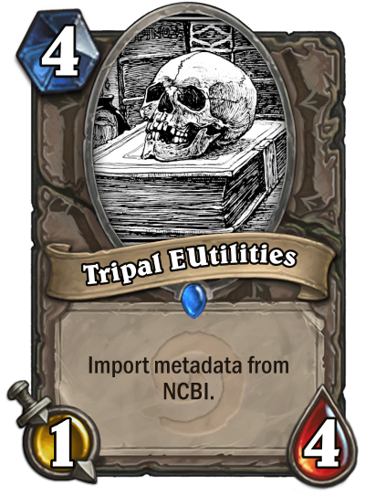

.. Tripal Apollo documentation master file, created by
   sphinx-quickstart on Thu Nov  8 10:43:33 2018.
   You can adapt this file completely to your liking, but it should at least
   contain the root `toctree` directive.

Tripal EUtils
=========================================

.. toctree::
  :maxdepth: 2
  :caption: Documentation:

  introduction
  installation
  user_guide
  examples
  ncbi_mapping
  development

.. image:: https://zenodo.org/badge/158557230.svg
   :target: https://zenodo.org/badge/latestdoi/158557230
