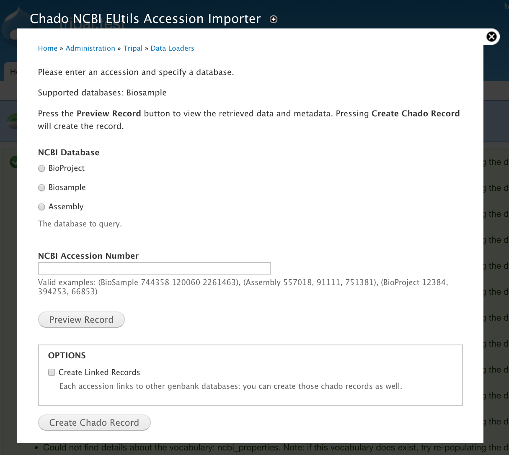
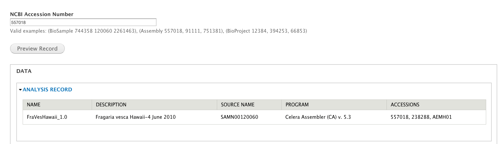
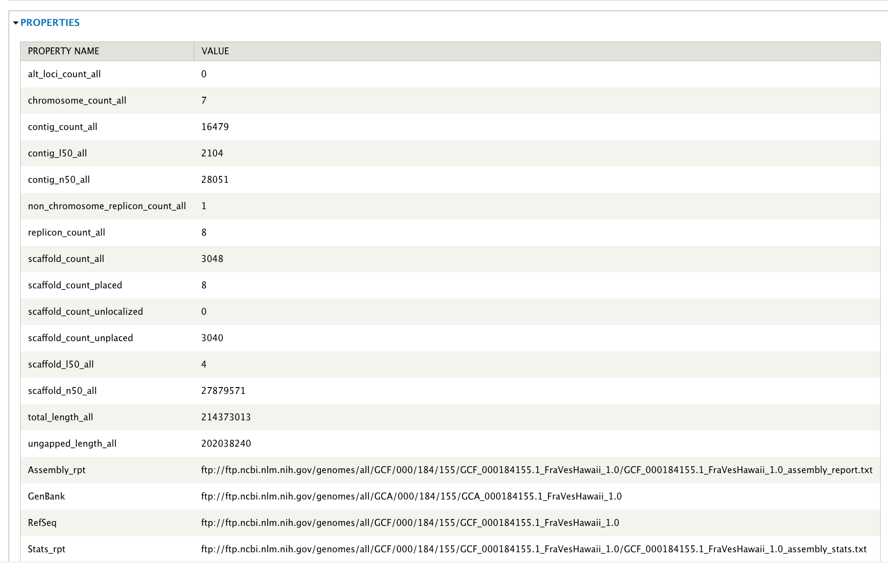
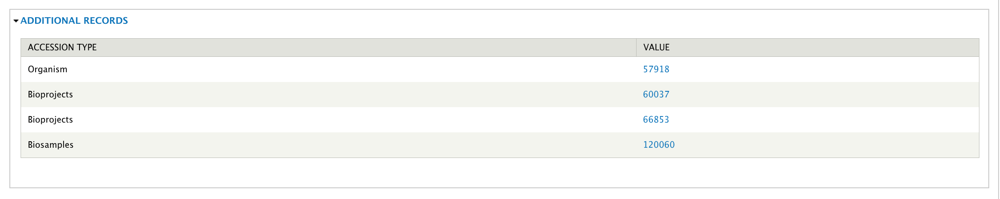
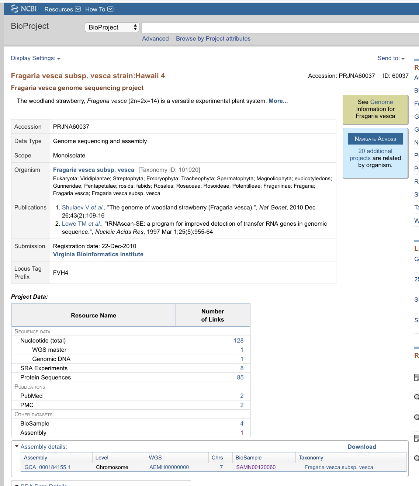

Using Tripal EUtils
===================

The EUtils accession importer form
-----------------------------------

The EUtils loader provides a fast and convenient way to import records from NCBI into Chado. It is available at ``admin/tripal/loaders/eutils_ncbi_import``.

  The EUtils import form (``admin/tripal/loaders/eutils_ncbi_import``).

In order to import records, you must choose a **NCBI Database** and provide an **NCBI Accession Number**.  Note that the accession number should be provided without the text database accession.  While these numbers are generally equivalent (IE ``PRJNA13179`` vs ``13179`` for BioProjects), in some cases they are not (Assemblies).

.. note::

  Please see :doc:`ncbi_mapping` for a list of currently supported databases, and for more information on how the information from NCBI will be loaded into Chado.

The **Create Linked Records** box, when checked, will not only create the primary accession input above, but any secondary accessions directly referenced in that record.  For example, a BioSample typically lists

Previewing Records
~~~~~~~~~~~~~~~~~~

After you've selected a database and an accession, you can use the **Preview Record** button to view the metadata and linked records that will be inserted.

The preview will first show the base Chado record created.  THe  values here are typically the primary fields of the Chado table (in this case, ``chado.analysis``), as well as any DBXrefs associated with it.

  Previewing the base record of an Assembly.

The properties associated with a record come from different tags depending on the NCBI database (as detailed in :doc:`ncbi_mapping`).  They are inserted into Chado into the property linker table: in this case, ``chado.analysisprop``.

  Previewing the properties of an Assembly.

Finally, the linked records section demonstrates what additional, cross-linked records will be inserted into Chado.  In the below example, two BioSamples, a BioProject, and an organism will be inserted.

.. note::

	If the linked record already exists in your database, it will be retrieved and reused.

  Previewing the linked records of an Assembly.

The linked records area links out to the record on NCBI: click on the **Value** link to double check the record information.

